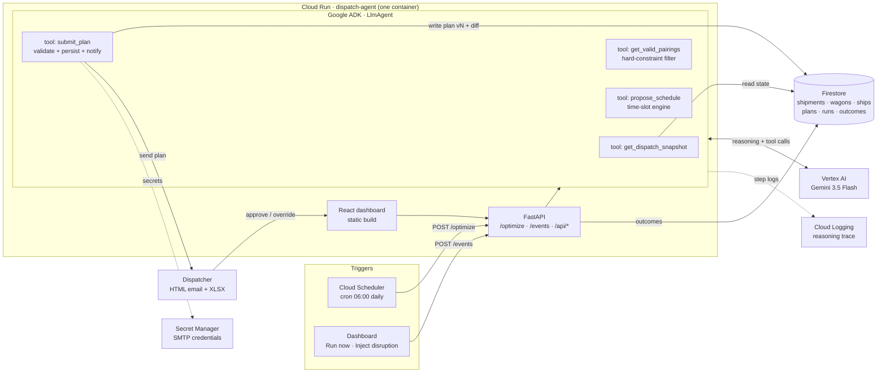

# Port Operations Dispatch Agent

**An autonomous agent that plans a port's cargo-loading day — and re-plans it live when things break.**

Built for the **All Things Agentic Hackathon** (Taskmaster track) with **Gemini + Google ADK + Cloud Run + Firestore + Cloud Scheduler**.

Every morning, a dispatcher decides which waiting shipment loads onto which rail wagon, in what order — juggling hazmat certification, cold-chain windows, weight limits, customer SLA tiers, wagon reservations, dock-team capacity, and hard ship cutoffs. Manually this takes ~45 minutes and gets it wrong under pressure. This agent does it in seconds, explains every decision with a confidence score, emails the dispatcher a formatted plan (+ Excel), and — when a wagon breaks down mid-morning — re-plans only the affected cargo and publishes a versioned diff.

## The demo in two clicks

1. **Run agent** → the agent ingests the port state, filters out every illegal cargo-wagon pairing *in code*, reasons about priorities and trade-offs, schedules 11 loads across 2 dock teams, holds a shipment stuck in customs, and emails the plan. Watch the live reasoning trace stream in the Agent Activity panel.
2. **Inject disruption → "Wagon W003 breakdown"** → the reefer wagon carrying two perishable shipments dies at 09:30. The agent triages the impact (4 loads already completed, 5 untouched, 2 affected), moves one shipment to the other reefer *and still makes its ship cutoff by 90 minutes*, and rebooks the one that can't make it onto the next sailing. Plan v2 ships with a full diff, ghost slots in the Gantt, and animated re-routes in the flow map. The dispatcher clicks **Approve**.

Two more scenarios are built in: a ship's loading cutoff moved earlier (the agent re-times cargo *earlier* to beat it) and a dock-team crane fault (loads spill to the surviving team).

## Architecture



### Who does what (the design principle)

| Layer | Owns | Why |
|---|---|---|
| **Deterministic Python** (agent tools) | Hard constraints: cargo-type rules, hazmat certs, capacity, reservations, cold-chain windows, dock/wagon calendars, cutoff math | An LLM must never be able to break physics or law. The model only ever sees *legal* options, and its output is re-validated anyway. |
| **Gemini 3.5** (via Google ADK) | Soft trade-offs: priority ordering, pairing choice among legal options, disruption recovery, per-assignment confidence + reason | There is no if-statement for "hazmat with one wagon option vs. perishable with two — who goes first?" |
| **`propose_schedule` tool** | Turning the model's chosen *order* into concrete times | The model decides sequence; the engine owns the clock. Gemini can iterate: propose → see conflicts → reorder. |
| **`submit_plan` tool** | Validation gate | An illegal plan bounces back with violations; the agent corrects itself (bounded retries). |
| **Human dispatcher** | Approve / override | Low confidence and rebookings are flagged; decisions land in `outcomes` for learning. |

If Vertex AI is unreachable mid-demo, the pipeline automatically falls back to a deterministic heuristic planner that runs the same tools — the run trace and UI say so honestly (`PLANNER: FALLBACK`).

## Run it locally (no cloud needed)

Prereqs: Python 3.11+, Node 18+.

```bash
# backend deps (minimal set for local mock mode)
pip install fastapi "uvicorn[standard]" "pydantic>=2.7" openpyxl

# build the dashboard
cd web && npm install && npm run build && cd ..

# start (memory store + deterministic planner, no GCP required)
uvicorn api.main:app --port 8000
```

Open http://localhost:8000 — seed data loads automatically. Press **Run agent**, then **Inject disruption**.

Tests:

```bash
python test_pipeline.py     # full story arc + assertions
python test_scenarios.py    # all three disruption scenarios
```

## Deploy to Google Cloud

**One-shot script** (run from [Cloud Shell](https://shell.cloud.google.com) after cloning, or any machine with the gcloud SDK):

```bash
bash deploy/deploy.sh YOUR_PROJECT_ID
```

It enables the APIs, creates Firestore, builds + deploys the Cloud Run service (`--no-cpu-throttling` so background agent runs never stall, 1 GiB RAM), grants the service account `aiplatform.user` + `datastore.user`, and creates the 06:00 Cloud Scheduler job (which calls `/optimize?sync=true` so headless runs complete inside the request). It prints the service URL and your run token.

Then prove the whole story end to end on the cloud — including that **Gemini via ADK** actually planned (not the fallback):

```bash
bash deploy/verify.sh https://YOUR_SERVICE_URL RUN_TOKEN
```

<details>
<summary>Manual steps (what the script does)</summary>

```bash
gcloud config set project YOUR_PROJECT_ID

# 1. enable services
gcloud services enable run.googleapis.com firestore.googleapis.com \
  aiplatform.googleapis.com cloudscheduler.googleapis.com secretmanager.googleapis.com

# 2. Firestore (native mode)
gcloud firestore databases create --location=nam5

# 3. deploy (builds the Dockerfile: node builds the dashboard, python serves it)
gcloud run deploy dispatch-agent --source . --region us-central1 \
  --allow-unauthenticated \
  --set-env-vars GOOGLE_GENAI_USE_VERTEXAI=TRUE,GOOGLE_CLOUD_PROJECT=YOUR_PROJECT_ID,GOOGLE_CLOUD_LOCATION=us-central1,STORE=firestore,PLANNER=gemini,RUN_TOKEN=change-me

# 4. let the service call Vertex AI + Firestore
PROJECT_NUMBER=$(gcloud projects describe YOUR_PROJECT_ID --format='value(projectNumber)')
SA="${PROJECT_NUMBER}-compute@developer.gserviceaccount.com"
gcloud projects add-iam-policy-binding YOUR_PROJECT_ID --member="serviceAccount:${SA}" --role=roles/aiplatform.user
gcloud projects add-iam-policy-binding YOUR_PROJECT_ID --member="serviceAccount:${SA}" --role=roles/datastore.user

# 5. morning trigger (optional but part of the story)
gcloud scheduler jobs create http daily-dispatch --location us-central1 \
  --schedule="0 6 * * *" --time-zone="Asia/Baku" --http-method=POST \
  --uri="https://YOUR_SERVICE_URL/optimize" --headers="X-Run-Token=change-me"

# 6. optional email delivery (Gmail app password in Secret Manager)
echo -n "your-app-password" | gcloud secrets create smtp-pass --data-file=-
gcloud secrets add-iam-policy-binding smtp-pass --member="serviceAccount:${SA}" --role=roles/secretmanager.secretAccessor
gcloud run services update dispatch-agent --region us-central1 \
  --set-secrets SMTP_PASS=smtp-pass:latest \
  --set-env-vars SMTP_HOST=smtp.gmail.com,SMTP_PORT=465,SMTP_USER=you@gmail.com,EMAIL_TO=dispatcher@example.com
```

</details>

Then open the `.run.app` URL. Cost guard: the service scales to zero when idle; Gemini calls for a plan cost cents. While recording the demo video, set `--min-instances 1` to kill cold starts (then back to 0). After submitting, `gcloud scheduler jobs pause daily-dispatch --location us-central1`.

## Environment variables

| Var | Default | Meaning |
|---|---|---|
| `PLANNER` | `auto` | `gemini` \| `mock` \| `auto` (Gemini when `GOOGLE_CLOUD_PROJECT` is set) |
| `GEMINI_MODEL` | `gemini-3.5-flash` | Vertex AI model id (the GA Gemini 3.5 model; 3.5 Pro is not public yet) |
| `STORE` | auto | `memory` \| `firestore` |
| `RUN_TOKEN` | `demo-token` | shared token for `/optimize`, `/events`, `/api/seed` |
| `TRACE_DELAY_MS` | `300` | pacing of trace steps for the live UI |
| `SMTP_HOST/PORT/USER/PASS`, `EMAIL_TO` | unset | real email delivery; without it the email + XLSX are rendered and shown in the dashboard |

## API

| Endpoint | Description |
|---|---|
| `POST /optimize` | run the morning batch plan (Cloud Scheduler / dashboard) |
| `POST /events` `{"scenario": "wagon_breakdown"}` | disruption → incremental re-plan, plan v(n+1) + diff |
| `GET /api/state` | full snapshot: fleet, ships, plans, runs, events, emails |
| `GET /api/runs/{id}` | live step trace of one agent run |
| `POST /api/plans/{id}/approve` · `/override` | human-in-the-loop decision → `outcomes` |
| `POST /api/seed` | reset the demo dataset |

## Project structure

```
agent/            the agent: ADK planner, fallback planner, pipeline, tools
  adk_planner.py    Gemini LlmAgent + function tools (snapshot/pairings/schedule/submit)
  mock_planner.py   deterministic fallback, same tools, transparent scoring
  pipeline.py       run orchestration: triggers -> planner -> validate -> publish
  tools/            prefilter · schedule engine · validator · impact analysis · notify
api/main.py       FastAPI: endpoints + serves the dashboard
core/             domain models, storage (memory/Firestore), KPIs, plan diff
data/seed.py      the story dataset (date-relative, reproducible)
web/              React + Vite control-tower dashboard
```

## Disclosures

- Built from scratch during the hackathon submission period.
- Third-party libraries: FastAPI, Uvicorn, Pydantic, openpyxl, React, Vite (all standard open-source; no pre-existing project code).
- Demo data is synthetic and engineered to exercise the constraint system (hazmat scarcity, cold-chain windows, reservations, customs holds, cutoff conflicts).
