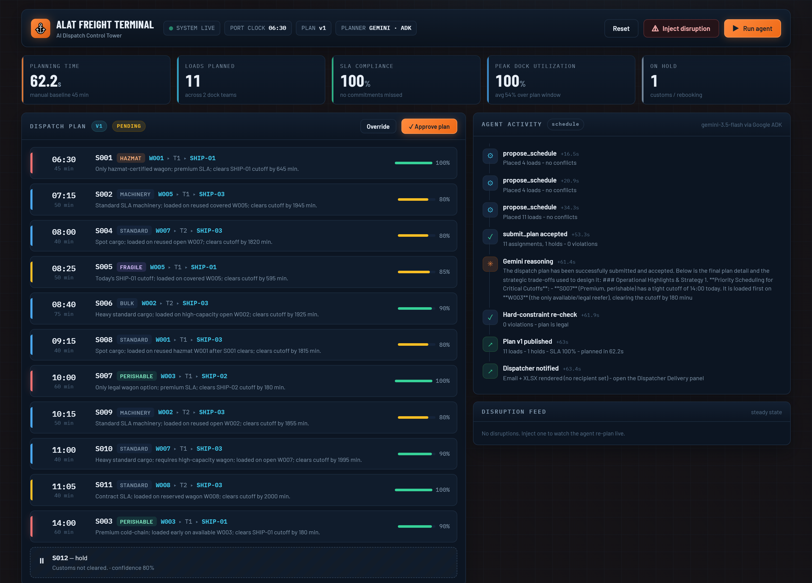
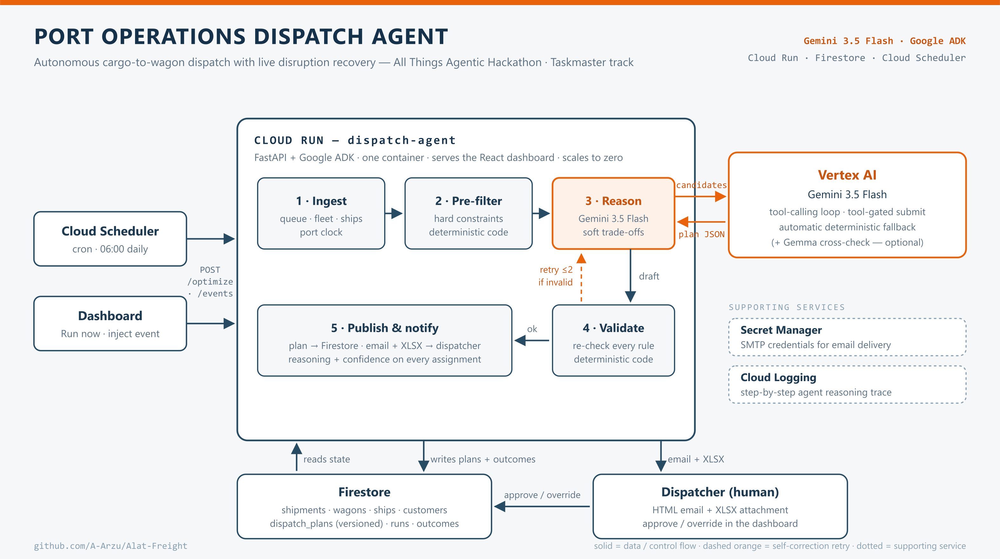
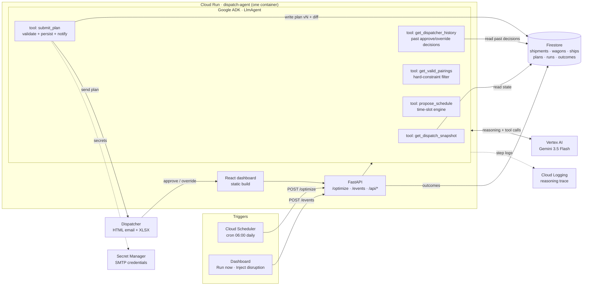

# Port Operations Dispatch Agent

> **An autonomous agent that plans a port's cargo-loading day — and re-plans it live when things break.**

Built for the **All Things Agentic Hackathon** (Taskmaster track).

[](https://github.com/A-Arzu/Alat-Freight/actions/workflows/ci.yml)
[](LICENSE)

**Gemini 3.5 Flash** · **Google ADK** · **Cloud Run** · **Firestore** · **Cloud Scheduler** · **Secret Manager** · **Cloud Logging**

### ▶ [Try the live dashboard](https://dispatch-agent-ygolewwlkq-uc.a.run.app)

No login. Press **Run agent**, then **Inject disruption → Wagon W003 breakdown**.
Submission answers: [DEVPOST.md](DEVPOST.md) · Video shot list: [docs/DEMO_SCRIPT.md](docs/DEMO_SCRIPT.md)



*The live control tower: Gemini 3.5 Flash (via Google ADK) plans 11 loads at 100% SLA in 62 seconds,
with a reason and confidence on every assignment, while the agent's tool calls and reasoning stream on
the right. Below — the system architecture.*



---

## The problem

Every morning, a port dispatcher decides which waiting shipment loads onto which rail wagon, in what order — juggling **eight kinds of constraints at once**: cargo-type rules (hazmat needs a certified closed wagon, perishables need a reefer, fragile needs cover), weight and axle limits, customer SLA tiers, cold-chain windows, wagon reservations and availability, dock-team capacity, customs status, and hard ship loading cutoffs. Done by hand this takes ~45 minutes, and under pressure the "wrong" wagon gets loaded first: premium cargo waits, perishables risk spoiling, ships sail without cargo that should have been aboard.

And that's the *easy* part. The real test is **10:30 AM, when a wagon fails inspection** and half the plan is suddenly wrong.

## What it does

1. **Ingests** the port state from Firestore: shipment queue, wagon fleet, ship schedule, dock-team calendars, port clock.
2. **Pre-filters in deterministic code**: every physically or legally impossible cargo-wagon pairing is removed *before the model ever sees it* (in the demo dataset: 51 illegal pairings eliminated, 37 legal options remain).
3. **Reasons with Gemini 3.5 Flash via Google ADK**: the model decides priority order, pairing, and wagon reuse across the day — the soft trade-offs no if-statement can express ("hazmat has one wagon option and a hard cutoff; the perishable has two options and a ship in 3 days — who goes first?").
4. **Computes times deterministically**: the model proposes an *order*; a gap-aware time-slot engine owns the clock. Gemini can never invent a load window.
5. **Validates and self-corrects**: the plan is only accepted through a tool-gated `submit_plan` that re-checks every hard constraint; violations bounce back and the agent corrects itself, bounded by the planner timeout.
6. **Publishes and notifies**: versioned plan to Firestore; formatted HTML email + Excel attachment to the dispatcher; per-assignment confidence and a one-sentence reason on everything.
7. **Re-plans on disruption**: wagon breakdown, ship cutoff moved, crane fault → deterministic impact analysis finds the affected subset, the agent re-plans *only that*, and publishes **plan v2 with a diff** — moved, retimed, rebooked, completed.
8. **Keeps a human in command**: the dispatcher approves, or overrides *with a typed reason*; every decision lands in the Decision log — and the agent reads those decisions back on its next run through `get_dispatcher_history`, lowering confidence on pairings a human previously rejected.

## Verified results (real runs on Google Cloud)

| Metric | Result |
|---|---|
| Planner | `gemini-3.5-flash` via Google ADK on Vertex AI |
| Morning plan | 11 loads scheduled, 1 hold (customs), **0 hard-constraint violations** |
| SLA compliance | 100% (morning) · 91% after wagon breakdown (1 unavoidable rebooking) |
| Peak dock utilization | 92% |
| Planning time | **~85 s** vs ~45 min manual baseline (~32× faster) |
| Disruption response | Plan v2: 1 shipment moved to the recovery reefer (clears its cutoff by 90 min), 1 rebooked to the next sailing, 5 loads recognized as already completed |
| Automation | Cloud Scheduler fires the 06:00 plan daily with no human involved |

Sample of Gemini's actual per-assignment reasoning from the deployed service:

> *"Premium SLA; only hazmat-certified wagon available to meet SHIP-01 cutoff."*
> *"Reuses covered wagon W005 after S005 to minimize port dwell time."*
> *"Only usable reefer wagon W006; premium SLA; clears SHIP-01 cutoff by 90 min."*

## The demo in two clicks

1. **Run agent** → live reasoning trace streams into the Agent Activity panel; the plan board, dock-team Gantt, and cargo-routing flow map fill in; the dispatcher email (+ XLSX) renders in the Delivery panel.
2. **Inject disruption → "Wagon W003 breakdown"** → the reefer carrying two perishable shipments dies at 09:30. Impact analysis, subset re-plan, and a full visual diff: ghost slots in the Gantt, animated re-routes in the flow map, "what changed" panel. Dispatcher clicks **Approve**.

Two more built-in scenarios: a ship's loading cutoff moved earlier (the agent re-times cargo *earlier* to beat it) and a dock-team crane fault (loads spill to the surviving team).

## Architecture

The design principle — **who does what**:

| Layer | Owns | Why |
|---|---|---|
| **Deterministic Python** (agent tools) | Hard constraints: cargo-type rules, certifications, capacity, reservations, cold-chain windows, calendars, cutoff math | An LLM must never be able to break physics or law. It only ever sees *legal* options, and its output is re-validated anyway. |
| **Gemini 3.5 Flash** (via Google ADK) | Soft trade-offs: priority ordering, pairing choice, wagon-reuse strategy, disruption recovery, per-assignment confidence + reason | There is no if-statement for competing priorities under scarcity. |
| **`propose_schedule` tool** | Turning the model's chosen *order* into concrete times | The model decides sequence; the engine owns the clock. Gemini iterates: propose → see conflicts → reorder. |
| **`submit_plan` tool** | The only door out | Illegal plans bounce back with named violations and the agent self-corrects, bounded by the 150 s planner timeout (`PLANNER_TIMEOUT_S`). |
| **`get_dispatcher_history` tool** | Memory | Recent approve/override decisions — including the reason a dispatcher typed — so the agent can lower confidence on a pairing a human previously rejected and say so. |
| **Automatic fallback** | Demo resilience | If Vertex AI is unreachable, a deterministic heuristic runs the same tools; the UI labels it honestly (`PLANNER: FALLBACK`). |
| **Gemma cross-check** (opt-in) | Second-model audit | With `ENABLE_GEMMA_AUDIT=true`, **Gemma** — a second, independent Google model — reviews Gemini's plan and flags any assignment it would decide differently; flagged assignments get lower confidence and Gemma's dissent in their reason. Advisory only: it can't break a hard constraint, and degrades to a clean no-op if unreachable. |
| **Human dispatcher** | Approve / override | Confidence scores and rebookings are flagged; decisions accumulate in `outcomes`. |

<details>
<summary>Mermaid diagram source (renders on GitHub)</summary>



</details>

## Project structure

```
agent/                the agent
  adk_planner.py        Gemini LlmAgent + tools (snapshot / history / pairings / schedule / submit)
  mock_planner.py       deterministic fallback - same tools, transparent scoring
  pipeline.py           run orchestration: trigger -> planner -> validate -> publish -> notify
  prompts.py            planner instruction (objectives, capacity facts, workflow, output contract)
  tools/                prefilter · time-slot engine · validator · impact analysis · email/XLSX
api/main.py           FastAPI: agent endpoints + dashboard API + static frontend
core/                 domain models (Pydantic), storage (memory | Firestore), KPIs, plan diff
data/seed.py          the story dataset - date-relative and reproducible
web/                  React + Vite control-tower dashboard
deploy/               deploy.sh · verify.sh · email_setup.sh
docs/                 architecture.svg / architecture.png
test_*.py             story-arc, all-scenarios, and ADK-wiring tests
```

## Run it locally (no cloud needed)

Prereqs: Python 3.11+, Node 18+.

```bash
pip install fastapi "uvicorn[standard]" "pydantic>=2.7" openpyxl
cd web && npm install && npm run build && cd ..
uvicorn api.main:app --port 8000
```

Open http://localhost:8000 — seed data loads automatically. Press **Run agent**, then **Inject disruption**. Locally the deterministic fallback plans (honestly labeled); set up Google credentials + `PLANNER=gemini` to use the real model.

**Tests**

```bash
python test_pipeline.py     # full story arc + assertions
python test_scenarios.py    # all three disruption scenarios
python test_email.py        # recipient validation, precedence, SMTP send/failure paths
python test_hardening.py    # stalled runs, plan-id collisions, store parity, re-run integrity
python test_gemma.py        # second-model audit: parsing, annotation, gating, graceful failure
python test_adk_wiring.py   # ADK agent/tool construction (pip install google-adk)
```

## Deploy to Google Cloud

**One-shot script** — run from [Cloud Shell](https://shell.cloud.google.com) after cloning:

```bash
bash deploy/deploy.sh YOUR_PROJECT_ID
```

It enables the APIs (Run, Firestore, Vertex AI, Scheduler, Secret Manager, Cloud Build, Artifact Registry), creates Firestore, builds + deploys the Cloud Run service (`--no-cpu-throttling` so background agent runs never stall; 1 GiB RAM), grants the service account `aiplatform.user` + `datastore.user`, and creates the 06:00 Cloud Scheduler job (calling `/optimize?sync=true` so headless runs complete inside the request). It prints your service URL and run token.

**Verify end to end** — proves the morning plan and the disruption re-plan on the cloud, and that **Gemini** (not the fallback) planned:

```bash
bash deploy/verify.sh https://YOUR_SERVICE_URL RUN_TOKEN
```

**Email delivery (Gmail)** — interactive; the app password is hidden-input and goes only to Secret Manager, never into env vars or shell history:

```bash
bash deploy/email_setup.sh
```

Create the app password first at [myaccount.google.com/apppasswords](https://myaccount.google.com/apppasswords) (requires 2-Step Verification). Port 465 uses implicit SSL; set `SMTP_PORT=587` and the sender switches to STARTTLS.

**Choosing the recipient — at runtime, in the app.** The dashboard's *Dispatcher delivery* panel has a **Send plans to** field: type an address and press **Save** (every future plan, including the 06:00 scheduled run, goes there) or **Send now** (emails the current plan immediately). Addresses are validated server-side, up to 5 comma-separated recipients are allowed, and the setting survives a demo reseed. Precedence is *one-off override → dashboard setting → `EMAIL_TO` env var*, so `EMAIL_TO` is only an optional fallback. With no SMTP configured at all, plans still render (with the XLSX) in that same panel.

**Demo-recording tips**

```bash
gcloud run services update dispatch-agent --region us-central1 --min-instances 1   # no cold starts on camera
gcloud run services update dispatch-agent --region us-central1 --min-instances 0   # back to scale-to-zero
gcloud scheduler jobs pause daily-dispatch --location us-central1                  # after submitting
```

Cost guard: everything scales to zero when idle; a full Gemini planning run costs cents.

## API

| Endpoint | Description |
|---|---|
| `POST /optimize` (`?sync=true`) | Morning batch plan. Async for the dashboard; sync for Cloud Scheduler. |
| `POST /events` `{"scenario": "wagon_breakdown"}` | Disruption → incremental re-plan → plan v(n+1) + diff. Scenarios: `wagon_breakdown`, `ship_advanced`, `team_outage`. |
| `GET /api/state` | Full snapshot: fleet, ships, plans, runs, events, emails (1.2 s cache). |
| `GET /api/runs/{id}` | Live step trace of one agent run. |
| `POST /api/plans/{id}/approve` · `/override` | Human-in-the-loop decision → `outcomes`. |
| `POST /api/settings/email` `{"recipient": "..."}` | Set (or clear) the dispatch-plan recipient at runtime. |
| `POST /api/plans/{id}/email` `{"recipient"?: "..."}` | (Re)send a plan, optionally to a one-off address. |
| `POST /api/seed` | Reset the demo dataset (keeps the chosen recipient). |
| `GET /api/health` | Health probe (`/healthz` exists too but Cloud Run's frontend reserves that path — see learnings). |

**Auth.** Mutating endpoints require an `X-Run-Token` header and accept two values: `RUN_TOKEN` (secret, used by Cloud Scheduler) and a UI token derived from it as `sha256(RUN_TOKEN + "|dashboard")[:24]`, which the dashboard reads from `/api/state`. The public dashboard therefore drives the demo without the Scheduler's token ever reaching the browser, and without a build-time constant that can drift from the deployed service. Run, email and seed endpoints are additionally rate-limited **per caller** (60 runs/hour, 25 sends/hour, 60 seeds/hour) so a public URL can't burn Gemini quota or become a mail relay — and one visitor can never lock out the operator.

## Environment variables

| Var | Default | Meaning |
|---|---|---|
| `PLANNER` | `auto` | `gemini` \| `mock` \| `auto` (Gemini when `GOOGLE_CLOUD_PROJECT` is set) |
| `GEMINI_MODEL` | `gemini-3.5-flash` | The GA Gemini 3.5 model (3.5 Pro is not publicly released) |
| `GOOGLE_CLOUD_LOCATION` | — | Use `global` so model calls route via Vertex's global endpoint |
| `STORE` | auto | `memory` \| `firestore` |
| `RUN_TOKEN` | `demo-token` | Secret token for Cloud Scheduler; the dashboard's token is derived from it |
| `TRACE_DELAY_MS` | `300` | Pacing of trace steps for the live UI |
| `SMTP_HOST/PORT/USER/PASS` | unset | Mail transport (`email_setup.sh` configures this; 465 = SSL, 587 = STARTTLS) |
| `EMAIL_TO` | unset | *Optional* fallback recipient — normally chosen in the dashboard at runtime |
| `ENABLE_GEMMA_AUDIT` | `false` | Opt-in second-model (Gemma) plan audit |
| `GEMMA_MODEL` | `gemma-3-27b-it` | Which Gemma model performs the cross-check |
| `GEMMA_API_KEY` | unset | A free [Gemini API key](https://aistudio.google.com/apikey) — the simplest way to reach Gemma (it serves the `gemma-*` models directly), even while the planner runs on Vertex |

## Data & scenarios

The synthetic dataset is **engineered to tell a story**: a hazmat shipment with exactly one certified wagon and a premium SLA; two perishables sharing the only available reefer under cold-chain windows; a heavyweight that fits one wagon; a reserved wagon honoring a standing agreement; a customs-blocked shipment; and a second reefer in transit until 15:30 — which becomes the recovery path when the first one breaks. Everything is date-relative to "today" with a frozen port clock, so runs are reproducible any time.

## Findings & learnings

- **Pre-filtering is what makes the LLM trustworthy.** Removing illegal pairings in code before the model sees them (and re-validating after) means Gemini reasons only about *which legal plan is best* — the failure mode shifts from "dangerous" to merely "suboptimal".
- **LLMs don't assume resource reuse.** Gemini's first cloud plan held 3 schedulable shipments citing "capacity limits" — it hadn't internalized that wagons can be reused after a turnaround. One prompt section of explicit *capacity facts* took it from 8 loads + 4 holds to a full 11-load day, with reuse called out in its own reasoning.
- **Give the model a calculator, not a calendar.** Letting Gemini propose an *order* while a deterministic engine computes times eliminated an entire class of hallucination.
- **Sync endpoints for headless runs.** Cloud Run throttles CPU after a response; a background planning thread can stall when nobody is polling. `?sync=true` for Cloud Scheduler (plus `--no-cpu-throttling`) makes automation bulletproof.
- **Test the UI against the deployed config, not just the API.** Our `curl` checks all passed while the *dashboard's own buttons* returned 401 in production: the Vite bundle had baked in `VITE_RUN_TOKEN`'s default at build time, which no longer matched the token the service was deployed with. A build-time secret in a client bundle is guaranteed to drift; serving a derived token from the API at runtime fixed it permanently. We would have discovered this while recording.
- **Production surfaces its own trivia:** Cloud Run's Google Frontend reserves `/healthz` (404 before reaching the container) and rejects bodyless `curl` POSTs with 411 unless `-d ''` sets a Content-Length.
- **Fallbacks fire in real life.** Our first deploy pointed at `gemini-3.5-pro` — which isn't publicly released — and the deterministic fallback kept the service functional (honestly labeled) while we fixed the model ID. Design for the demo to never die.
- **The dangerous bugs live in the gap between two implementations.** Our `MemoryStore.update()` no-ops on a missing key while Firestore's `set(merge=True)` *creates* the document — so an unexpected id would have written a phantom record with no `id` field, and every later run would crash on `{s["id"]: s ...}`. Local tests could never have caught it; the fix was making Firestore's semantics match memory's exactly.
- **Treat model output as untrusted input, all the way through.** A priority outside 1–3 would have failed Pydantic validation *after* planning succeeded — past the Gemini→fallback safety net, turning a cosmetic model slip into a dead run. Coercing and clamping at the tool boundary keeps a bad number from becoming an outage.
- **Model output can be incomplete, not just wrong.** Nothing forced Gemini to account for every shipment, so one could silently vanish from the plan, the board *and* the email. `submit_plan` now rejects any plan that leaves an in-scope shipment neither assigned nor explicitly held.

## What's next

- Connect real port systems (TOS shipment feeds, wagon telemetry) in place of the seed data.
- Continuous re-planning: watch Firestore for state changes instead of explicit events.
- Learn from `outcomes`: track predicted vs. actual load times and calibrate confidence.
- Cost objectives: minimize crane hours and dwell simultaneously.
- Gemma cross-check: run the same pre-filtered problem through Gemma and flag disagreements as low confidence.

## Disclosures

- Built from scratch during the hackathon submission period; all commits are within it.
- Third-party open-source libraries: FastAPI, Uvicorn, Pydantic, openpyxl, React, Vite, google-adk, google-genai, google-cloud-firestore. No pre-existing project code.
- Demo data is synthetic.

## License

MIT — see [LICENSE](LICENSE).
